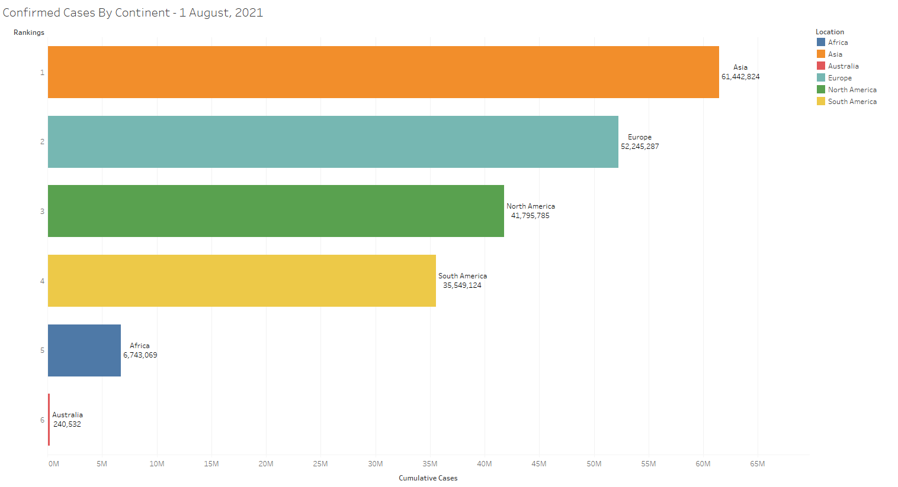

# **COVID-19 ETL Pipeline**

# Preface
This README documents the purpose of the project, how to setup the automated pipeline, and future plan for development. This project was expanded based on my [COVID-19 Data Exploration Project](https://github.com/AspiringDSer/PortfolioProjects/tree/main/SQL-Projects/COVID-19_Data_Exploration_Project) and [COVID-19 Tableau Dashboard Project](https://github.com/AspiringDSer/PortfolioProjects/tree/main/Tableau-Projects/COVID-19_Dashboard). For more details about the initial work, please refer to the provided links.  

# Table of Content 
1. [Setup](#Setup)
2. [About the Project](#AboutTheProject)
3. [Future Developments](#FutureDevelopments)

# Setup <a name='Setup'></a>
**Environment**

In order to setup, ensure that you have `conda` installed. 

1. Open `Anaconda Prompt` and ensure you are in the correct system path 
2. Create conda environment

    ```
    conda env create -f environment.yml
    ```
3. Activate conda environment 
    ```
    conda activate COVID_ETL
    ```

**Run Pipeline**

Please execute the following commands to:

Setup ETL Pipeline 
```
python ETL_setup.py
```
Update ETL Pipeline
```
python ETL_update.py
``` 

# About The Project <a name='AboutTheProject'></a>

**ETL Pipeline**

The pipeline is used to extract and preprocess COVID-19 Data from ourworldindata.org. The cleaned data will be loaded into a MySQL Database. The database will then be connected to a Tableau Dashboard that show the total confirmed COVID-19 Cases Per Continent. 



[Tableau Public](https://public.tableau.com/views/COVID-19ConfirmedCasesByContinent/Dashboard1?:language=en-US&publish=yes&:display_count=n&:origin=viz_share_link) - Due to Tableau Public, the data is static and you cannot view the animations. The data is relevant up till Aug 2nd 2021. I have attached a [MP4 recording](https://github.com/AspiringDSer/COVID19-ETL-Pipeline/blob/master/Confirmed_Cases_By_Continent%20-%20Dashboard%20Video.mp4) (click view raw) of the animations. In addition, you can activate animations in the Tableau Workbook to see the confirmed cases per day per continent. 

**Files:**

* ETL_setup.py
* ETL_update.py
* COVID-19 Dashboard.twb
* CHANGELOG&#46;md
* environment.yml 
* Confirmed_Cases_By_Continent - Dashboard Video.mp4

`ETL_setup.py` - Initial Setup - Section 1 
1. Check if directory has existing history log 
2. Pull COVID-19 Data (CSV file) from ourworldindata.org
3. Clean data 
4. Connect to MySQL
5. Import cleaned CSV to MySQL
6. Query to create Table for Tableau Dashboard
7. Create history log

`ETL_update.py` - Update ETL Pipeline - Section 2
1. Convert history log to dataframe
2. Check if files are updated via history log
3. If data is up to date, return "Data is Up to date" message
4. If data is NOT up to date, repeat inital steps 2-7

MySQL to Tableau - Section 3 
1. Connect MySQL with Tableau 
2. Create Tableau Public Dashboard  

# Future Developments <a name='FutureDevelopments'></a>
The COVID-19 ETL Pipeline still needs further refinement. I  plan continue development in these areas: 

* Update Markdown and Comments 
* Add Unit Testing
* Improve Assertion in Python Scripts
* Configure and Implement Tableau Python (TabPy) to Pipeline
* Creating Package for Pipeline 
