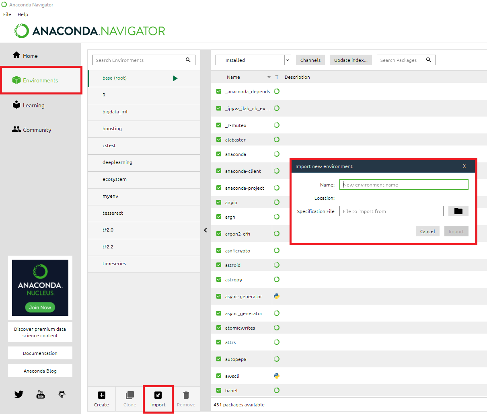

# **COVID-19 ETL Pipeline**

# Preface
This README documents the purpose of the project, how to setup the automated pipeline, and future plan for development. This project was expanded based my [COVID-19 Data Exploration Project](https://github.com/AspiringDSer/PortfolioProjects/tree/main/SQL-Projects/COVID-19_Data_Exploration_Project) and [COVID-19 Tableau Dashboard Project](https://github.com/AspiringDSer/PortfolioProjects/tree/main/Tableau-Projects/COVID-19_Dashboard). For more details about the initial work, please refer to the provided links.  

# Table of Content 
1. [Setup](#Setup)
2. [About the Project](#AboutTheProject)
3. [Future Developments](#FutureDevelopments)

# Setup <a name='Setup'></a>
**Environment**

In order to setup, ensure that you have `conda` installed. 



1. Open your `Anaconda Navigator` and click on the `Environments` Tab.
2. Click on the `Import` Tab. Create a name for the virtual  environment and specify the path file for where `environment.yml` is located. 

3. Click `Import` to create virtual environment. 

4. Open `Anaconda Prompt`

5. Activate the environment with `conda activate myenv` 

**Run Pipeline**

Setup ETL Pipeline 

```
python ETL_setup.py
```

Update ETL Pipeline
```
ETL_update.py
``` 

# About The Project <a name='AboutTheProject'></a>

**ETL Pipeline**

The pipeline is used to extract and preprocess COVID-19 Data from ourworldindata.org. The cleaned data will be loaded into a MySQL Database. The database will then be connected to a Tableau Dashboard that show the total confirmed COVID-19 Cases Per Continent. 


NOTE: In the Tableau Workbook, you can activate animations to show confirmed cases per day per continent. 

**Files:**

* ETL_setup.py
* ETL_update.py
* COVID-19 Dashboard.twb
* CHANGELOG&#46;md
* environment.yml 

`ETL_setup.py` - Initial Setup - Section 1 
1. Check if directory has existing history log 
2. Pull COVID-19 Data (CSV file) from ourworldindata.org
3. Clean data 
4. Connect to MySQL
5. Import cleaned CSV to MySQL
6. Query to create Table for Tableau Dashboard
7. Create history log

`ETL_update.py` Update ETL Pipeline - Section 2
1. Convert history log to dataframe
2. Check if files are updated via history log
3. If data is up to date, return "Data is Up to date" message
4. If data is NOT up to date, repeat inital steps 2-7

MySQL to Tableau - Section 3 
1. Connect MySQL with Tableau 
2. Create Tableau Public Dashboard  

# Future Developments <a name='FutureDevelopments'></a>
The COVID-19 ETL Pipeline still needs further refinement. I  plan continue development in these areas: 

* Update Markdown and Comments 
* Add Unit Testing
* Improve Assertion in Python Scripts
* Configure and implement Tableau Python (TabPy) to pipeline